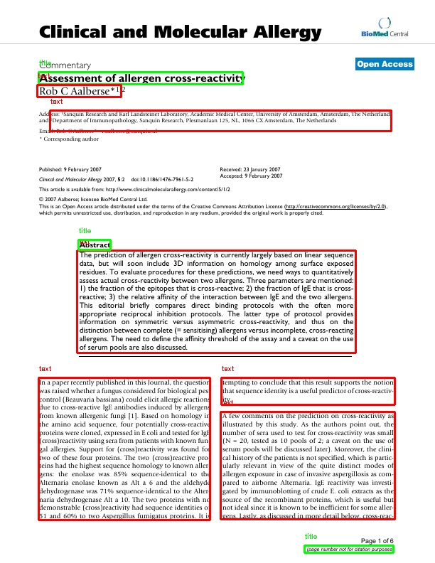

# PyDoc
A library for interacting with pdf documents.

### Installation
```
pip install py-doc
```

### Get Started
How to use the library:

```python
from py_doc import Document 

# Instantiate a Document object 
image = Document('path/to/image.jpg')

# Use draw_classifications to find document classifications
image.draw_classifications("outupt.jpg")

# Additionally, if you just want the bounding boxes use get_bounding_box()
image.get_bboxes()
```
To do optical character recognition (OCR), you will need to install [Tesseract](https://github.com/tesseract-ocr/tesseract)
on your machine and make sure it is added to your PATH. If you don't need OCR, you can skip this step. 

```python
from py_doc import Document
image = Document('path/to/image.jpg')

# Use get_text() to get all the text from the image
print(image.get_text())

# Use get_text_from_bbox() to get text from a specific bounding box
bbox = image.get_bboxes()[0]
print(image.get_text_from_bbox(bbox))
```

### Documentation
The documentation for this library can be found [here](https://py-doc.readthedocs.io/en/latest/index.html#).

### Examples
This image is a sample of the output of the draw_classifications() method. The bounding boxes are drawn around the document classifications.


### Contributing
Run the following instructions after pushing to the repo:
1. make html (update documentation - need to be in docs directory)
2. update version in setup.py
3. python setup.py sdist bdist_wheel (builds the package)
4. twine check dist/* (checks the package)
5. twine upload dist/* (uploads the package to PyPi)

